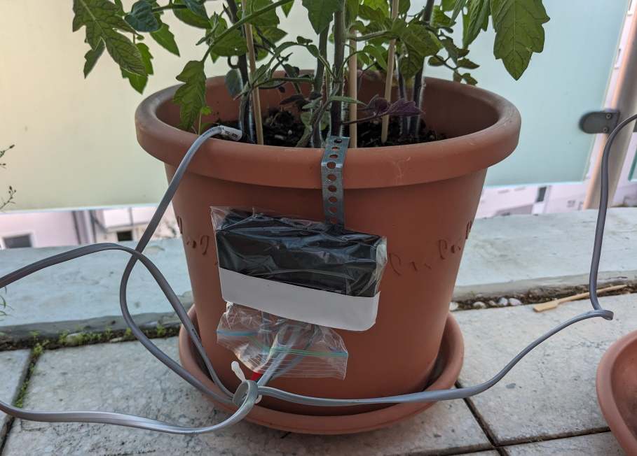
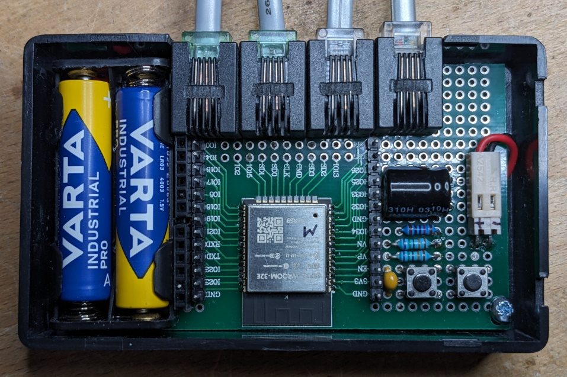
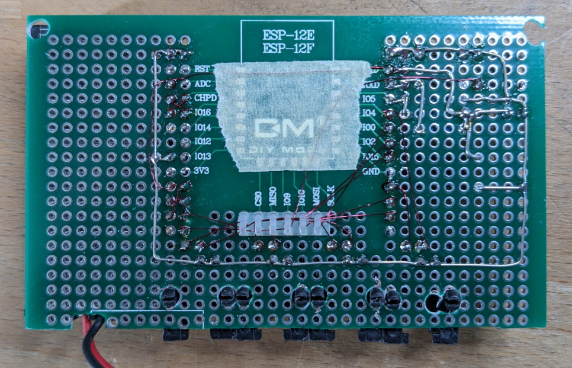

MySoilSensorESP32 -- a multi-channel soil moisture sensor with long battery life
----
This is part of my home automation setup. For details, see my [blog](https://requireiot.com/my-home-automation-story-part-1/).

 

## Objective
In summer, I have a lot of potted plants out on the balcony, and need to know when to water them. Indoors, I have mostly home automation gadgets based on MySensors, but out on the balcony the signal is too weak, so I needed something Wifi-based, but without the high battery consumption typical of Wifi solutions.

## Architecture
- an ESP32 module with custom software
- two AA or AAA batteries, which should last for more than a year
- up to 4 cheap capacitive soil sensors, of the kind you find at Aliexpress for under a Euro
- my home network, with a DHCP server assigning pseudo-static IP addresses to everybody (based on MAC address)
- my home automation system, with an MQTT broker and OpenHAB for visualization and control

## Build instructions

 

The hardware is very simple, see the [schematic](hardware/MySoilSensorESP32.pdf). 

For development and debugging, I added pin connectors to connect to FTDI-232 style 
USB-to-serial interfaces, one for the primary UART (for firmware upload) and one 
for UART#2, where the software outputs logging messages. For a production system, 
this is not necessary and can be left out, of course.

The software was developed using [Platformio](https://platformio.org/). Just 
download the repository contents into an empty folder, and open that folder as 
a Platformio project. 

In folder `src/`, rename file `myauth_sample.h` to `myauth.h` and enter your 
Wifi SSID and password.

Edit file `platformio.ini` and enter the COM port and IP address for your 
environment. I built multiple units and wanted to update each of them over-the-air, 
so I needed a separate entry for each in `platformio.ini`, specifying each 
IP address as assigned by my DHCP server.

I used a 7x9 cm prototype board for ESP32 and ESP8266 boards, cut to fit inside 
a 100x60x25 mm plastic case. The soil sensors are connected via cables with an 
RJ12 6P4C connecter on the module end, for easy connection "in the field".

The capacitive soil sensors commonly available on Aliexpress or Amazon mostly use 
an NE555 chip that only works down to 3.0V, whereas the ESP32 itself will still 
work when the battery voltage is as low as 2.5V, so I replaced the NMOS NE555 
with the CMOS version ILC555D, which work down to 2.0V.

## MQTT messages

The device publishes to an MQTT topic that includes its own hostname:
- to <code>soil/__hostname__/debug</code> it publishes a JSON string with various internal parameters, such as battery voltage, Wifi quality, uptime etc., once every 12 hours
- to <code>soil/__hostname__/state</code> it publishes a JSON string with measurement results, once every hour 
- it subscribes to <code>soil/__hostname__/ota</code> to enable over-the-air updates (see below)

For example, my device has the hostname `esp32-D80270`, so it will publish to `soil/esp32-D80270/state` etc.

## Over-the-air update

The device supports OTA firmware updates, despite the fact that it is in deep 
sleep most of the time. How? When it wakes up, it subscribes MQTT topic 
<code>soil/__hostname__/ota</code> (see above), and if it finds a retained message 
with the payload of `1`or `ON`, it will enable ArduinoOTA and wait for an upload 
of new firmware, instead of going to sleep. It also changes the topic to `OFF`. 

To perform an OTA firmware update,
1. compile your code for the target that has "-ota" in its name (look at `platformio.ini` and adjust the IP address or device hostname to match your conguration)
1. publish a retained message for topic <code>soil/__hostname__/ota</code> with the payload of 'ON' For my device `esp32-D80270`, with my home automation server named `ha-server`, I run the following shell comand:   
 `mosquitto_pub -h ha-server -r -t "soil/esp32-D80270/ota" -m "ON"`
1. wait for the item to revert to OFF. I watch it with a tool like MQTT Explorer, or run this shell command repeatedly   `mosquitto_sub -h ha-server -t "soil/esp32-D80270/ota"`  
1. upload your firmware via Platformio

## Power saving considerations

Minimize deep sleep power consumption:
  - a bare ESP32-WROOM module is better than a development module -- probably due to the voltage regulator and USB interfaces on those modules
  - use a LDO voltage regulator with low quiescent current -- I found the HT7833 works well
  - alternatively, power the device directly from two AA or AAA batteries -- in this case, you may need to modify the soil sensors as described above
  - the soil sensors are *powered* by GPIO pins, which are turned off during sleep

Minimize the duration of active Wifi during a wake period:
  - try to reconnect to Wifi using previously established SSID, IP and channel number, which are cached in RTC memory
 
Power consumption, during deep sleep, with a bare ESP32-WROOM, powered from 2x AA battery is **14µA**, or powered from 3x AAA battery via LDO voltage regulator is **14µA**.

## Power consumption and battery life

These factors contribute to power consumption or battery drain, in decreasing order of importance:
1. the self-discharge of the batteries, according to [[1]](http://www.gammon.com.au/power), about 35 µA or **0.84 mAh** per day (for AAA batteries)
2. wake time with WiFi on, up to 130 mA x ~1000ms per wakeup every hour, or **0.87 mAh** per day
4. deep sleep, at ~14 µA or **0.34 mAh** per day
5. the voltage divider for battery monitoring, bringing the 3.0V or 4.5V battery voltage down to the 2.5V accepted by the ESP32 ADC, at 2x 470 kOhm, or **0.08 mAh** per day

## Wake time

As explained above, the time the mdule stays awake each measurement cycle is important for overall power consumption, so I investigated the wake time in some detail.

I build several of these units, so connected directly to the Wifi access point 
( a AVM Fritzbox 7530), and some via a Wifi repeater (a Fritz Repeater 1200ax), 
over a distance of 3-5m, through a massive outer brick wall ( or maybe through a window).

On average, the wake time is about **1000 ms** for all units. Now and then, maybe 
once or twice a day, the wake time is much larger, between **2000-3500 ms**. 
This does not occur for all units at the same time, so it can't be due to, say, 
the Wifi access point switching to a different Wifi channel. I have no explanation 
for this behavior.